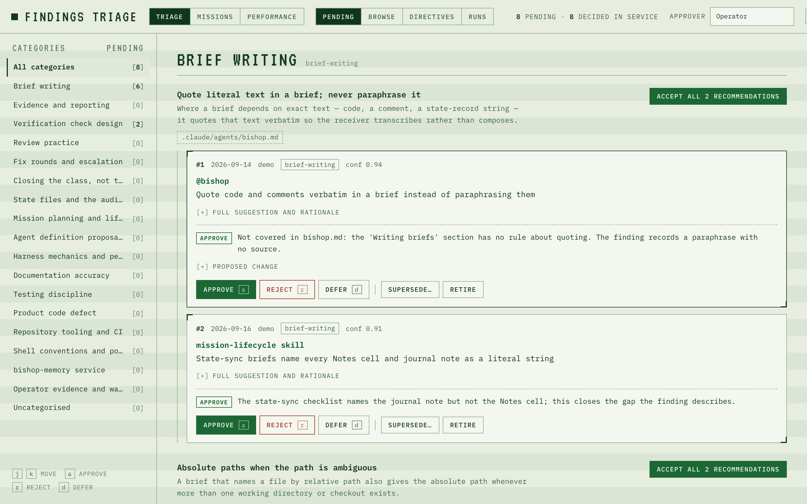
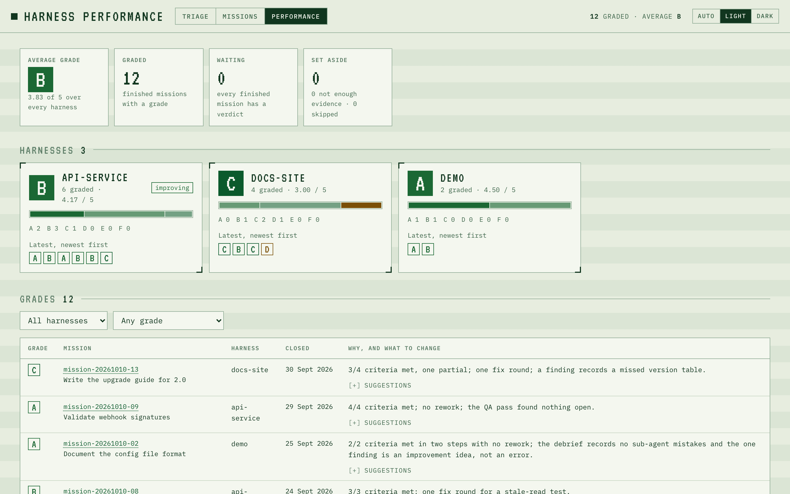
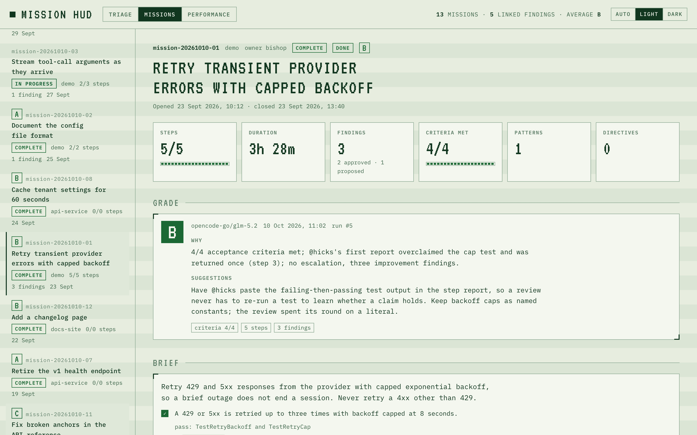

# bishop-memory

A memory service for the Bishop agent harness. One Go binary, one SQLite database with full-text search, an MCP adapter the crew talks to, a nightly findings-triage loop with a review page for the operator, a mission HUD that shows each mission's history on one page, and a nightly A–F grade on every finished mission rolled up into harness performance.

- **Go + Gin + SQLite (FTS5)**, `modernc.org/sqlite`, so there is no C toolchain and the binary cross-compiles statically.
- **Local by default, networked when you need it.** On loopback with no keys it needs no configuration; on a server it requires an API key from every client. See [Server Install](docs/wiki/Server-Install.md).
- **Markdown is the source of truth.** The service is a derived copy that several harnesses can share; the reconciler keeps it in step.

## Documentation

| Audience | Start here |
|---|---|
| **End users** — run a harness against it, review findings, follow missions | [User Guide](docs/wiki/User-Guide.md) · [Home Server Setup](docs/wiki/Home-Server-Setup.md) · [Server Install](docs/wiki/Server-Install.md) · [MCP Tool Reference](docs/wiki/MCP-Tool-Reference.md) · [Review Page Guide](docs/wiki/Review-Page-Guide.md) · [Mission HUD Guide](docs/wiki/Mission-HUD-Guide.md) · [Commands and Scripts](docs/wiki/Commands-and-Scripts.md) · [Troubleshooting](docs/wiki/Troubleshooting.md) |
| **Developers** — change the service | [Overview](docs/wiki/Developer-Overview.md) · [HTTP API](docs/wiki/Developer-HTTP-API.md) · [Database](docs/wiki/Developer-Database.md) · [MCP Adapter](docs/wiki/Developer-MCP-Adapter.md) · [Scripts and Reconciler](docs/wiki/Developer-Scripts-and-Reconciler.md) · [Triage Agents](docs/wiki/Developer-Triage-Agents.md) · [Testing and CI](docs/wiki/Developer-Testing-and-CI.md) · [Harness Integration](docs/wiki/Developer-Harness-Integration.md) |
| **Plans and history** | [Roadmap](docs/ROADMAP.md) · [Design plans](docs/README.md) · [Changelog](CHANGELOG.md) |

The pages under `docs/wiki/` are the documentation, published to the [GitHub wiki](https://github.com/djm56/bishop-memory/wiki) with `make wiki-publish`; `docs/wiki/` is the source of truth. The rest of `docs/` holds only the roadmap and active design plans.

## Quick start

```bash
git clone git@github.com:djm56/bishop-memory.git && cd bishop-memory

# Run in the foreground (127.0.0.1:8787, data/memory.db)
make run
make health                      # {"ok":true,"schema":"ok",...}

# Or install as a service that starts at login and restarts on exit
scripts/install-daemon.sh --memory-root /abs/path/to/a/harness/.claude/memory    # macOS, launchd
sudo scripts/install-daemon-linux.sh                                              # Linux, systemd

# Build the MCP adapter every harness .mcp.json points at
make build-mcpd

# Or run it on a server that other machines reach with API keys (next section)
```

Re-running the installer after `git pull` is the upgrade path: it rebuilds, restages and restarts, and the database schema upgrades itself at boot.

## Install on your own server

To run bishop-memory on an Ubuntu (or other systemd Linux) server on your own network, follow **[Home Server Setup](docs/wiki/Home-Server-Setup.md)** step by step. It installs memoryd under `/opt/bishop-memory` as a systemd service, serves HTTPS with a certificate from your own mkcert CA, requires an API key, lets only your Mac in, moves your existing database over, and points the Mac's harnesses, triage and browser at it. In outline:

```bash
# Mac: a certificate for the server, signed by your own CA
mkcert -install && mkcert -cert-file bishop-server.pem -key-file bishop-server-key.pem SERVER_IP
scp bishop-server*.pem server:/tmp/

# Server: install as a systemd service under /opt
sudo git clone https://github.com/djm56/bishop-memory.git /opt/bishop-memory && cd /opt/bishop-memory
sudo scripts/install.sh server --host SERVER_IP --first-key mac --allow-from MAC_IP/32 \
  --tls-cert /tmp/bishop-server.pem --tls-key /tmp/bishop-server-key.pem
sudo ufw allow OpenSSH && sudo ufw allow from MAC_IP to any port 8787 proto tcp && sudo ufw enable

# Mac: connect (prompts for the key the server printed)
scripts/install.sh client --url https://SERVER_IP:8787 --ca "$(mkcert -CAROOT)/rootCA.pem"
```

The guide also covers moving the Mac's database, the edits inside each harness, the triage schedule, nightly backups, updating and going back. Other layouts (Tailscale, a reverse proxy, a Mac as the server, several clients) are in [Server Install](docs/wiki/Server-Install.md).

## Connect a harness

The connection is configured from the harness, not from here. In the harness checkout: copy `.claude/bishop-memory.conf.example` to `.claude/bishop-memory.conf`, set `BISHOP_MEMORY_MODE=central`, a unique `BISHOP_HARNESS`, and `BISHOP_MEMORY_HOME` pointing at this checkout; run `.claude/connect-bishop-memory.sh`; restart Claude Code and approve the `bishop-memory` MCP server. Then reconcile once:

```bash
/path/to/bishop-memory/scripts/reconcile-memory.py --root .claude/memory --harness <name>
```

Without the conf file a harness runs standalone and never calls the service. Details: [Developer: Harness Integration](docs/wiki/Developer-Harness-Integration.md).

## What it stores

Ten harness-vocabulary tables — `missions`, `mission_steps`, `flight_recorder` (the audit journal), `crew`, `findings`, `patterns`, `service_records`, `directives`, `documents`, `documents_fts` — plus seven findings-triage tables and `mission_grades`. Schema: [db/schema.sql](db/schema.sql); every table explained: [Developer: Database](docs/wiki/Developer-Database.md).

Two rules are enforced by what is registered where, not by the API key (every key has full access):

1. **A finding's status belongs to the operator.** Agents create findings as `proposed`; the one route that changes status is `POST /v1/findings/:id/decision`, which no MCP profile exposes.
2. **Directives are read-only to agents.** Only the reconciler (mirroring `DIRECTIVES.md`) and the operator's ratification route write them.

## MCP tools

`cmd/mcpd` is a stdio MCP server that proxies the HTTP API. It registers one of two tool sets, chosen by `MCPD_PROFILE`:

**Harness profile** (default, 16 tools) — what a Bishop crew uses during a mission.

| Read | Write |
|---|---|
| `memory_search`, `mission_list`, `mission_get`, `mission_steps_list`, `finding_list`, `pattern_list`, `service_record_list` | `mission_allocate`, `mission_create`, `mission_update`, `flight_recorder_append`, `mission_step_record`, `finding_append`, `pattern_append`, `service_record_append`, `documents_sync` |

`flight_recorder_append` and `mission_step_record` record the actor as `<BISHOP_HARNESS>:<agent>`; `finding_append` records the harness. `finding_list` filters by status, triage category, harness and ids.

**Triage profile** (`MCPD_PROFILE=triage`, 15 tools) — what the three scheduled agents use: `triage_categories`, `triage_next_unclassified`, `triage_classify`, `triage_category_findings`, `triage_recent_decisions`, `triage_group_create`, `triage_recommend`, `directive_propose`, `triage_run_start`, `triage_run_finish`, the mission grader's `grade_claim` and `grade_write`, plus the read-only `finding_list`, `pattern_list`, `memory_search`. The two profiles share no write tool.

Every tool, with arguments, examples and errors: [MCP Tool Reference](docs/wiki/MCP-Tool-Reference.md).

## Findings triage

<picture>
  <source media="(prefers-color-scheme: dark)" srcset="docs/wiki/images/pending-dark.png">
  
</picture>

Findings accumulate faster than anyone reads them. bishop-memory classifies the ledger into a 17-category taxonomy nightly (Haiku), groups one category's findings by the rule they share and recommends a decision on each (Sonnet), on Claude Code or, with `TRIAGE_ENGINE=opencode`, on any model your OpenCode config reaches, and drafts `DIRECTIVES.md` entries — all for you to decide on a review page at `http://127.0.0.1:8787/triage`. Decisions are written back into the owning harness's Markdown. No agent ever changes a finding's status.

```bash
printf 'ANTHROPIC_API_KEY=sk-ant-...\n' >> .env && chmod 600 .env   # scheduled jobs have no Claude login
make triage-seed                                                     # load db/finding-categories.json
make triage-backfill REGISTER="kirsch=/abs/path/kirsch/.claude/memory"
make triage-classify                                                 # classify everything now
make triage-process                                                  # recommend on the next category
make triage-review                                                   # open the review page
make triage-export                                                   # write decisions to FINDINGS.md / DIRECTIVES.md
make triage-grade                                                    # grade up to 10 finished missions
make triage-install                                                  # nightly launchd jobs (21:00 / 21:20 / 21:40)
make screenshots                                                     # regenerate the screenshots in the docs
```

The screenshots are produced from made-up demo data on a throwaway service (`scripts/screenshots/`), never from a real ledger, because they are published.

Guides: [Review Page Guide](docs/wiki/Review-Page-Guide.md) and [Developer: Triage Agents](docs/wiki/Developer-Triage-Agents.md). Outstanding work: [docs/ROADMAP.md](docs/ROADMAP.md).

## Mission grading

<picture>
  <source media="(prefers-color-scheme: dark)" srcset="docs/wiki/images/performance-dark.png">
  
</picture>

Every finished mission gets a grade from A to F, a short summary of why and suggestions for the next mission, from a third nightly agent (21:40) that works from the database alone. The service hands it a compact packet per mission — the brief's criteria, the debrief's judgement sections, the steps, findings and agent notes, and counts it makes itself — and the agent makes one pass over at most ten missions. A verdict is final; a mission is never graded in a loop. Grades show on the mission HUD and roll up per harness at `http://127.0.0.1:8787/performance`. Guide: [Mission Grading](docs/wiki/Mission-Grading.md).

## Mission HUD

<picture>
  <source media="(prefers-color-scheme: dark)" srcset="docs/wiki/images/missions-dark.png">
  
</picture>

`http://127.0.0.1:8787/missions`, beside `/triage` (and where `/` redirects), shows one mission at a time: the brief with its acceptance criteria ticked from the debrief, a step timeline with each agent's crew role, timing and summary, the linked findings with their triage state, the debrief, and the patterns, directives, crew, service records and journal entries that belong to it. A Triage / Missions / Performance switch links the pages, and each finding links across to the other.

```bash
curl -X POST http://127.0.0.1:8787/v1/documents/sync   # import every registered harness's memory tree and agents
make mission-links                                     # one-off: link existing findings and steps (APPLY=1 to write)
make scratch-clean                                     # list workspace scratch older than 30 days (APPLY=1 to move to the Trash)
```

Guide: [Mission HUD Guide](docs/wiki/Mission-HUD-Guide.md). Plan, with the deferred phase 2: [docs/plans/MISSION-HUD-PLAN.md](docs/plans/MISSION-HUD-PLAN.md).

## Configuration

Environment variables, with optional `.env` in the working directory (gitignored).

| Variable | Default | Read by | Purpose |
|---|---|---|---|
| `HTTP_HOST` | `127.0.0.1` | memoryd | Bind address. Anything other than loopback requires an API key; with none, memoryd refuses to start |
| `PORT` | `8787` | memoryd, scripts | Listen port |
| `DB_PATH` | `data/memory.db` | memoryd | SQLite file; relative to the working directory |
| `APP_ENV` | `development` | memoryd | Gin mode |
| `LOG_LEVEL` | `info` | memoryd | Advisory |
| `BISHOP_API_KEYS_FILE` | `api-keys` beside `DB_PATH` | memoryd | Hashed API keys; manage with `memoryd keys add\|list\|revoke` |
| `BISHOP_API_KEY` | — | memoryd | One extra key, named `env` |
| `BISHOP_ALLOW_NO_AUTH` | — | memoryd | `1` lets memoryd run on a network address with no key (not recommended) |
| `TLS_CERT_FILE`, `TLS_KEY_FILE` | — | memoryd | Both set: serve HTTPS |
| `MEMORYD_ENV_FILE` | `.env` | memoryd | Settings file read at start; the server installer points it at its own |
| `MEMORY_ROOT` | `testdata/memory` | memoryd | Root for `documents_sync` when the caller omits one and no harness is registered |
| `BISHOP_MEMORY_URL` | `http://127.0.0.1:8787` | mcpd, scripts | Service URL |
| `BISHOP_MEMORY_API_KEY` | — | mcpd, scripts | API key sent as `Authorization: Bearer`. Both this and the URL are also read from `~/.config/bishop-memory/client.env` (written by `scripts/install.sh client`) when the environment does not set them |
| `BISHOP_HARNESS` | `claude-code` | mcpd | Harness identity composed into actors and stored on findings |
| `MCPD_PROFILE` | `harness` | mcpd | `harness` or `triage` tool set |
| `ANTHROPIC_API_KEY` or `CLAUDE_CODE_OAUTH_TOKEN` | — | triage runner | Required for scheduled agent runs on the claude engine; keep it in `.env`, mode 0600 |
| `TRIAGE_*` | see [Commands and Scripts](docs/wiki/Commands-and-Scripts.md#scriptstriage-runsh) | triage runner | Engine (`claude` or `opencode`), item caps, models, budgets, timeout, log directory |

## Network and security model

- **Loopback, no keys: open.** The default single-machine install binds `127.0.0.1` and asks for nothing, exactly as before.
- **API keys.** `memoryd keys add <name>` creates a named key and prints it once; the keys file holds only SHA-256 hashes and is re-read on change, so adding or revoking needs no restart. Once any key exists, every `/v1` route needs one (`Authorization: Bearer <key>` or `X-API-Key`); `/healthz`, the two pages and their icons stay open because they hold no data. The access log names the key behind each request.
- **Required off loopback.** On any other address memoryd refuses to start without a key (unless `BISHOP_ALLOW_NO_AUTH=1`), and revoking the last key refuses every request rather than opening the service.
- **Transport.** A key over plain HTTP can be read on the wire. On your own network, use built-in TLS with a certificate from your own mkcert CA, which clients trust through `BISHOP_MEMORY_CA_FILE` in `client.env` ([Home Server Setup](docs/wiki/Home-Server-Setup.md)). Alternatives: Tailscale or WireGuard, built-in TLS (`TLS_CERT_FILE`, `TLS_KEY_FILE`), a reverse proxy such as Caddy in front of a loopback-bound memoryd (create a key first: on loopback with none it is open), or an SSH tunnel. memoryd warns at start when it serves plain HTTP on a network address.
- **Every key has full access.** There are no roles and no rate limiting. What agents can do is still limited by the `mcpd` tool lists (see [MCP tools](#mcp-tools)). `POST /v1/documents/sync` reads any server path a caller names (except `/`), so a key can also pull Markdown and JSONL from any directory the service user can read into search.

Step by step for one server on your own network: [Home Server Setup](docs/wiki/Home-Server-Setup.md). Every option: [Server Install](docs/wiki/Server-Install.md).

## Development

```bash
make test            # go test ./...
make vet             # go vet ./...
make fmt             # gofmt
go test -race ./...  # CI also runs this
```

CI (`.github/workflows/ci.yml`) runs build, vet, gofmt, test and test -race on Linux for every push. Conventions and the verification gate: [CONTRIBUTING.md](CONTRIBUTING.md) and [Developer: Testing and CI](docs/wiki/Developer-Testing-and-CI.md).

## Repository map

```
cmd/memoryd         HTTP daemon          internal/api        handlers and router
cmd/mcpd            MCP adapter          internal/store      SQLite, schema, migrations
db/schema.sql       schema               internal/importer   Markdown → FTS5
db/finding-categories.json  taxonomy     internal/ui         /triage and /missions pages
scripts/            installers, reconciler, triage, wiki     .claude/agents, .claude/skills   the triage agents
                                                             .opencode/agents                 their OpenCode twins
docs/               roadmap and plans    docs/wiki/          user and developer pages (published to the wiki)
```

## License

See [LICENSE](LICENSE).
