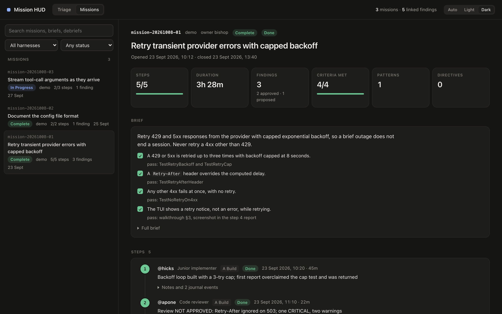
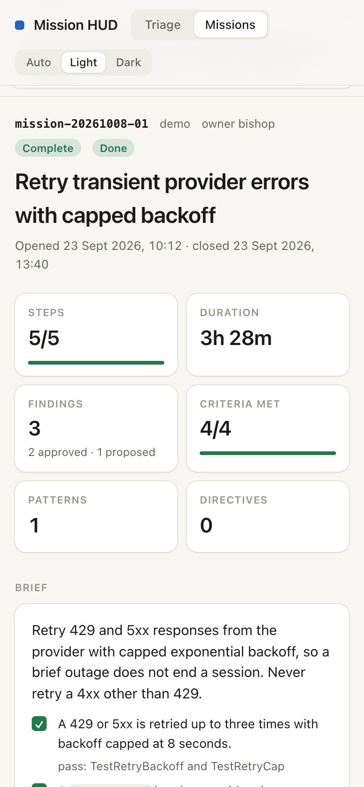
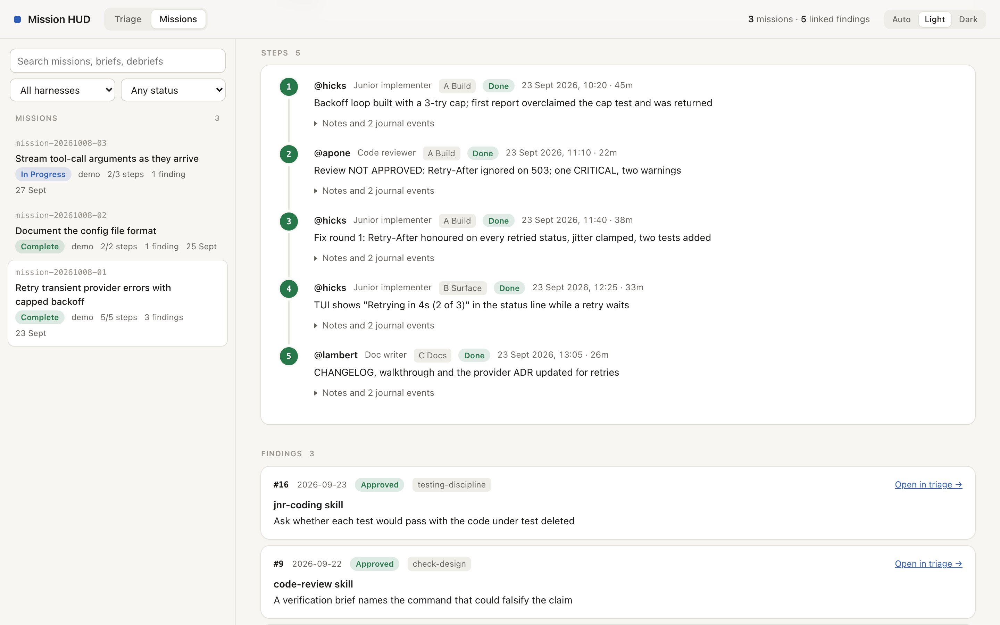

# Mission HUD Guide

The mission HUD at `http://127.0.0.1:8787/missions` shows the whole history of a mission in one place: what it set out to do, how each step went, how it ended, and the findings, patterns and directives that came out of it. Like the review page it is one embedded HTML page served by `memoryd`, reachable through the same SSH tunnel as the API. `http://127.0.0.1:8787/` redirects here.

The page only reads. Nothing on it changes a mission, a step or a finding; decisions on findings stay on the [review page](Review-Page-Guide).


## Moving between Triage and Missions

Both pages carry a **Triage / Missions** switch in the header, and they share the theme setting.

- A finding on `/missions` has an **Open in triage →** link. It goes to `/triage?finding=<id>`, which opens the Browse tab on just that finding, with a **show all** link back to the full list. `?finding=` also takes a comma-separated list, `?finding=12,13`.
- A finding card on `/triage` shows its mission id when it has one. The id links to `/missions#<mission id>`.

The mission on screen is the part of the URL after `#`, so a mission can be bookmarked or sent as `http://127.0.0.1:8787/missions#mission-20261008-01`.

## Appearance

The control at the right of the header switches between **Auto**, **Light** and **Dark**, as on the review page, and the choice is the same saved setting: change it on one page and the other follows. `?theme=light` or `?theme=dark` overrides it for one page load.

| Dark | Phone width |
|---|---|
|  |  |

Below 860 pixels wide the layout stacks: the header wraps and the mission list sits above the selected mission in a scrolling box.

## The mission list

The left rail lists every mission, newest first. Each row shows the id, title, status (or `failed` when the mission ended with outcome `failed`), harness, steps done out of steps recorded, linked findings and the date it opened. The header counts the missions shown and their linked findings.

Above the list:

- **Search** matches the mission id and title, and runs a full-text search over the mission's brief, progress and debrief. It needs those documents imported (see [How data gets there](#how-data-gets-there)).
- **Harness** narrows to one harness; each option shows its mission count.
- **Status** narrows to `in-progress`, `blocked`, `complete` or `not-started`.

The harness and status filters are remembered in the browser. Search is not.

Click a mission to open it on the right. With no `#` in the URL the newest mission opens.

## One mission

### Header and tiles

The header gives the id, harness, owner, priority when it is not `normal`, status and outcome, the title, when it opened and closed, and the next action or blockers when the mission records them.

The tiles below it:

| Tile | Shows |
|---|---|
| Steps | Done out of recorded, with a bar |
| Duration | Opened to closed, or to now while the mission is still open |
| Findings | Linked findings, broken down by status |
| Criteria met | Acceptance criteria ticked out of listed; only when the brief lists criteria |
| Patterns | Patterns discovered on this mission |
| Directives | Directives ratified from proposals whose evidence includes this mission's findings |

### Brief

The goal from `BRIEF.md`, and the brief's **Acceptance Criteria** list. Each criterion is ticked or crossed from the debrief's **Acceptance Criteria Outcome** section, in order: a `- [x]` line ticks it, a `- [ ]` line crosses it, and the text after ` — ` on that line is shown as its evidence. Until there is a debrief the boxes are empty and the tile says `no debrief yet`. **Full brief** shows the whole file.

When the section says **No brief imported**, the mission's files have not reached the database; see [Troubleshooting](Troubleshooting#mission-hud).

### Steps



A timeline of the mission's steps in step order. Each step shows its number, its agent and that agent's crew role (hover the agent for the full description), its phase, status, start time and duration, and the one-line summary the harness wrote when the step finished. **Notes and N journal events** expands to the step's `PROGRESS.md` notes and every flight-recorder event recorded against the step.

Start and end times are recorded by the service as the step moves to `in-progress` and then `done` or `failed`. Steps recorded before the HUD existed have times only if the backfill below found them in the journal.

### Findings

The findings linked to this mission, each with its id, date, status, triage category (or `uncategorised`), a **directive candidate** tag where the classifier set one, the target, the classifier's summary (or the suggestion) and the processor's recommendation and rationale. A decided finding shows its approver, date and note. **Open in triage →** takes you to the finding on the review page.

### Debrief

`DEBRIEF.md`, rendered. An open mission says the debrief is written when the mission closes.

### Patterns, directives, crew, service records

Each section appears only when there is something in it.

- **Patterns** discovered on this mission, with the solution and example one click away.
- **Directives** ratified from proposals that cite this mission's findings as evidence.
- **Crew**: every agent named on a step, with its description from the harness's agent definitions.
- **Service records** for those agents dated from the day the mission opened to the day it closed (today, while it is open).

### Journal

**Show every flight-recorder event** lists the mission's whole journal: time, step, agent, event and note. **PROGRESS.md as written** shows the file as the database holds it.

## How data gets there

The HUD reads only the database. Missions, steps, the journal and findings arrive the way they always have, through the harness hook, the MCP tools and the reconciler (see [User Guide](User-Guide#7-keeping-markdown-and-the-service-in-step)). The brief, progress and debrief are documents, and need the harness registered with its memory root:

```bash
curl -X PUT http://127.0.0.1:8787/v1/harnesses/kirsch \
  -H 'Content-Type: application/json' \
  -d '{"memory_root":"/abs/path/kirsch/.claude/memory"}'
```

The reconciler does the same on every run with `--harness`, so a harness that has been reconciled once is already registered. `memory_root` must be an absolute path.

Then, three things keep the documents current:

- **Sync every harness.** `POST /v1/documents/sync` with an empty body imports the memory tree of every registered harness, tags each document with its harness and, for `missions/<id>/BRIEF.md`, `PROGRESS.md` and `DEBRIEF.md`, its mission. The same call reads each harness's agent definitions (the `agents/` directory beside the memory root, such as `.claude/agents/`) into the crew list. Run it by hand; a reconcile does the same for its own harness, since it syncs `--root` first.

  ```bash
  curl -X POST http://127.0.0.1:8787/v1/documents/sync                    # every registered harness
  curl -X POST http://127.0.0.1:8787/v1/documents/sync -d '{"harness":"kirsch"}'   # one
  ```

- **Mission updates.** Each `PATCH /v1/missions/<id>` (the `mission_update` tool) re-imports that mission's three files from its harness's memory root. A mission with no harness, or a harness with no registered root, is skipped.
- **New findings.** A finding appended without a mission id is linked to its harness's open mission (`in-progress` or `blocked`, most recently updated), unless it is dated before that mission opened.

## The one-off backfill for existing data

Findings, step times and step summaries recorded before the HUD existed carry no mission link. Fill them once:

```bash
curl -X POST http://127.0.0.1:8787/v1/documents/sync   # first, so debriefs carry their mission
make mission-links                                     # dry run: reports what it would change
make mission-links APPLY=1                             # write
make mission-links RENAME="kirsch-opencode=kirschopencode" APPLY=1   # also merge a stray harness name
```

In one transaction it:

1. moves rows from each `RENAME` old harness name to the new one and deletes the old `harnesses` row;
2. deletes documents that lie under no registered harness memory root (left by an old sync pointed at a whole repository);
3. fills empty step start and end times from the journal's step events, and empty step summaries from `step-sync` events;
4. links findings to missions: first from the `[YYYY-MM-DD] — target` references in each debrief's **Findings and Patterns Linked** section, then by time, when exactly one mission of the finding's harness was open when it was recorded. A finding that fits several missions is left unlinked and listed.

It only ever fills empty columns. With `APPLY=1` it first copies the database to `data/memory.bak-<timestamp>.db`, and it refuses to write while a triage run is in progress.

## Clearing old scratch

A harness keeps scratch notes, backups and calibration logs under `<memory root>/workspace/`, and a full sync makes them searchable. Clear the old ones by hand:

```bash
make scratch-clean                         # dry run: files older than 30 days, every harness
make scratch-clean DAYS=60 HARNESS=kirsch  # another age, one harness
make scratch-clean APPLY=1                 # move them
```

With `APPLY=1` each file older than `DAYS` (by modification time) is moved into the macOS Trash under `bishop-scratch-<timestamp>/<harness>/`, and its search documents are deleted. `workspace/README.md` and hidden files such as `.gitkeep` stay. Nothing runs this on a schedule.

## About these screenshots

Like the review-page images they are produced from made-up demo data on a throwaway service by `make screenshots`, so no real mission appears in a published image.

## What the page cannot do, on purpose

- It cannot change a mission, step or finding. Missions change through the harness; findings are decided on the review page.
- It cannot import files. The brief, progress and debrief appear after a document sync or a mission update.
- It does not parse the debrief into fields beyond the acceptance criteria lines. The rest is shown as written.
