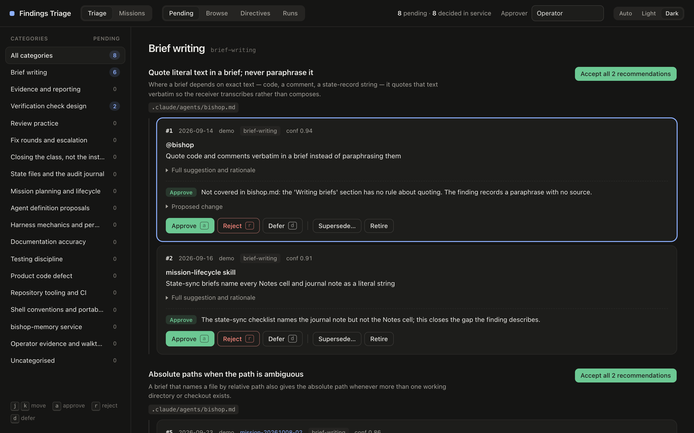
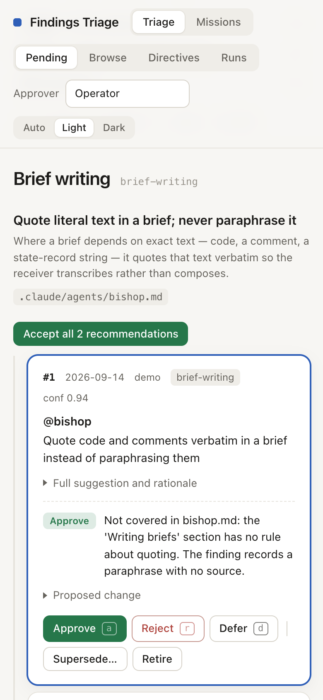
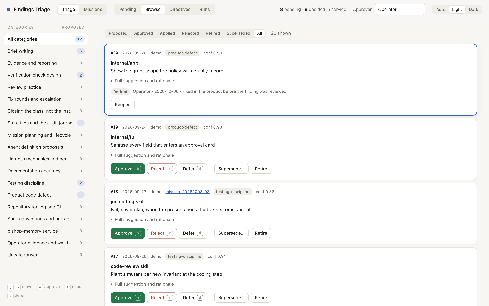
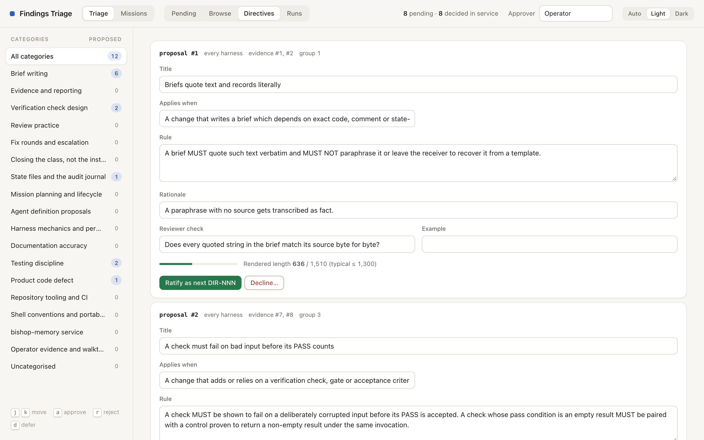
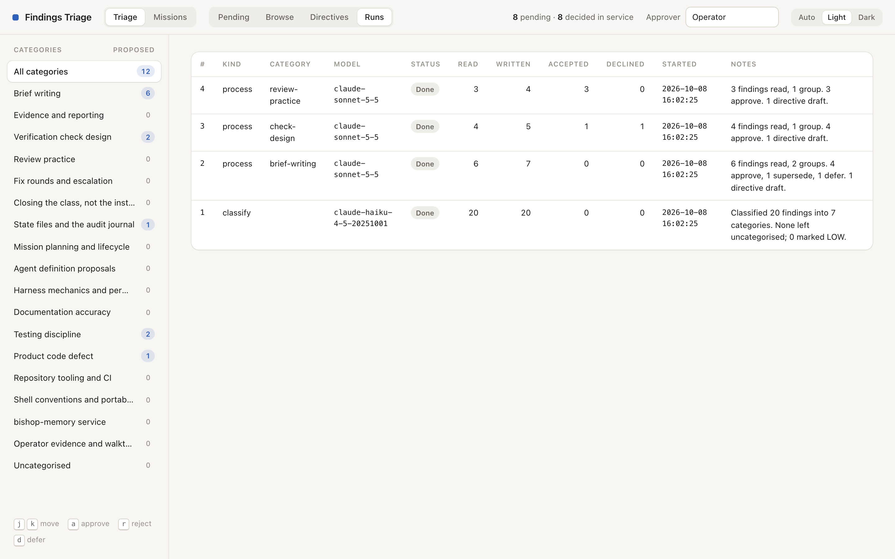

# Review Page Guide

The review page at `http://127.0.0.1:8787/triage` is where findings get decided and directives get ratified. It is one embedded HTML page served by `memoryd`; nothing to install, reachable through the same SSH tunnel as the API. Open it with `make triage-review`.

## Triage and Missions

The **Triage / Missions** switch in the header moves between this page and the [mission HUD](Mission-HUD-Guide) at `/missions`. The two pages share the theme setting.

- A finding card that has a mission shows the mission id; it links to `/missions#<mission id>`, that mission on the HUD.
- `/triage?finding=<id>` (or `?finding=12,13`) opens the Browse tab on just those findings, with a **show all** link back to the full list. The HUD's **Open in triage →** links use it.

## Before you start

Type your name in the **Approver** box once. It is stored in the browser and written as `Approver` on every decision, so the exported `FINDINGS.md` entry reads `**Approver**: Donovan Maidens` exactly as a hand-approved one does.

## Appearance

The control at the right of the header switches between **Auto**, **Light** and **Dark**. Auto follows the operating system. The choice is saved in the browser and applies on the next visit. Adding `?theme=light` or `?theme=dark` to the URL overrides the saved choice for that page load only.

| Dark | Phone width |
|---|---|
|  |  |

Below 860 pixels wide the layout stacks: the header wraps and the category list sits above the findings instead of beside them. The page stays usable on a phone over the SSH tunnel.

## The four tabs

### Pending


What the processor has recommended and you have not decided. The left rail lists categories with a count badge: pending recommendations on this tab, proposed findings on the others. Click one to narrow the view, or stay on **All categories**.

Within a category, **groups** come first. A group is a set of findings the processor judged to be instances of one rule; its header shows that rule, the doctrine file the fix belongs in, and **Accept all N recommendations**. Below the groups come **ungrouped** findings.

Each finding card shows:

- the id, date, owning harness, category, confidence and one-line summary;
- the target and the classifier's summary, with the full suggestion and rationale one click away;
- the recommendation badge (`approve`, `reject`, `supersede by #N`, `defer`) and its rationale, written to be checkable: a quoted sentence, a file, a finding id;
- for an approve, the **proposed change**: before/after text against the target file as it is today, with a **Copy** button that confirms with a toast. You paste it; the agent never edits a file.

Buttons on a proposed finding:

| Button | Effect | Needs |
|---|---|---|
| Approve | `status = approved`, approver and date recorded | nothing |
| Reject | `status = rejected` | a reason, written as `Disposition (triage)` in the Markdown |
| Defer | nothing is written; the card stays pending for later | nothing |
| Supersede… | `status = superseded`, with the surviving finding's id | the id, and a reason is composed for you |
| Retire | `status = retired` | a reason |

**Accept all N recommendations** on a group takes each member's recommendation as the decision: approves become approved, rejects become rejected with the model's rationale as the reason, supersedes become superseded. Defers are left alone. Use it when a group reads right; use the per-card buttons when one member does not.

When you decide against the recommendation, that is recorded: the recommendation closes as `declined`, and the Runs tab counts it. The processor reads your recent decisions in a category before it recommends again, so disagreeing teaches it.

### Browse



Every finding, by category and status, with the same buttons. This is where you reach findings the processor has not got to yet, and where **Reopen** undoes a decision (it sets the finding back to `proposed` and clears the approver, date and note).

### Directives



Each pending draft is an editable form: title, applies-when, rule, rationale, reviewer check, example, with the evidence finding ids. A meter under the form shows the rendered length against the template budget as you edit. It turns amber above 1,300 characters (the typical size) and red above 1,510 (the absolute maximum, which the service refuses).

**Ratify** allocates the next `DIR-NNN`, stores your edited text, mirrors the directive into the `directives` table, marks every evidence finding `applied` with the note `Ratified as DIR-NNN`, and closes their pending recommendations. **Decline** needs a reason.

The entry does not reach `DIRECTIVES.md` until you export (below).

### Runs



Every classifier and processor run: category, model, how many findings it read, how many rows it wrote, and how many of its recommendations you accepted or declined. A category whose acceptance rate falls is the one whose description in `db/finding-categories.json` wants tightening; see [Developer: Triage Agents](Developer-Triage-Agents).

## Keyboard

`j` / `k` move the focus between cards. `a` approves, `r` rejects (prompts for the reason), `d` defers. The buttons show their key. Shortcuts are ignored while you type in a field and whenever Cmd, Ctrl or Alt is held, so Cmd+A selects text instead of approving the focused finding.

## Getting decisions into the Markdown

The header counts decided findings in the service. Decisions reach the harness files only when you run:

```bash
make triage-export                              # every registered harness
scripts/export-decisions.py --harness kirsch --dry-run   # preview one
```

For each decided finding the exporter finds the entry in that harness's `FINDINGS.md` by its natural key and rewrites exactly three lines — `**Status**`, `**Approver**`, `**Date approved**` — plus one `**Disposition (triage):**` line for a reject, retire or supersede. Ratified directives are appended to `DIRECTIVES.md` in template form with an index row. Before every write it copies the file to `<memory_root>/workspace/triage-backups/`, writes atomically, and re-reads to confirm.

Run it when no mission in that harness is mid-sync. It cannot start a reconcile loop: the harness hook only fires on Claude Code tool writes.

If the file already says something other than `proposed` and it differs from your decision, the exporter reports a **conflict**, leaves the entry alone and exits 3. The file wins; the next reconcile mirrors the file's status into the service. Reopen and re-decide on the page if the file was wrong.

## About these screenshots

They are generated by `make screenshots` from made-up demo data (`scripts/screenshots/demo.json`) on a throwaway service, so no real finding appears in a published image. Re-run it after a design change and publish with `make wiki-publish`.

## What the page cannot do, on purpose

- It cannot edit a skill, agent or finding text. Proposed changes are text to paste.
- It cannot run the agents. `make triage-classify` and `make triage-process` do that; the nightly jobs do it unattended.
- It cannot write Markdown. `make triage-export` does, so that a file write is always a deliberate step you ran.
